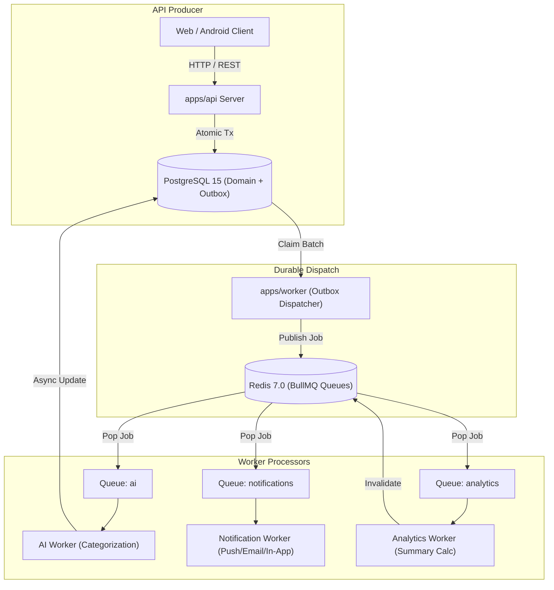

# Asynchronous Processing Architecture (BullMQ & Outbox)

**Version:** 2.0.0  
**Status:** Implemented (Phase 2)  
**Modules:** `apps/api`, `apps/worker`, `@homemind/shared`

---

## 1. System Architecture Overview

HomeMind decouples high-throughput transactional database writes from heavy computation, notifications, AI categorization, and analytics aggregations using a combination of the **Transactional Outbox Pattern** and **BullMQ on Redis**:



---

## 2. Queue Topology & Concurrency Specifications

| Queue Name | Queue Key | Default Concurrency | Environment Config | Typical Payloads |
| :--- | :--- | :--- | :--- | :--- |
| **Transactions** | `transactions` | 5 | `TRANSACTION_WORKER_CONCURRENCY` | SMS parse, external bank webhook ingestion |
| **AI** | `ai` | 2 | `AI_WORKER_CONCURRENCY` | Merchant heuristic categorization, LLM inference |
| **Notifications** | `notifications` | 10 | `NOTIFICATION_WORKER_CONCURRENCY` | In-app alerts, bill due reminders, family invitations |
| **Analytics** | `analytics` | 3 | `ANALYTICS_WORKER_CONCURRENCY` | Daily financial rollup, monthly budget utilization |

---

## 3. Job Retry & Backoff Configuration

All BullMQ queues in HomeMind enforce exponential backoff to prevent thundering herds on downstream services:

```typescript
{
  attempts: 5,
  backoff: {
    type: 'exponential',
    delay: 1000 // 1s, 2s, 4s, 8s, 16s
  },
  removeOnComplete: {
    age: 86400, // Retain completed metadata for 24 hours
    count: 5000
  },
  removeOnFail: {
    age: 604800, // Retain failed payloads for 7 days (DLQ)
    count: 10000
  }
}
```

---

## 4. Dead Letter Queue (DLQ) Handling

When a job exhausts all 5 attempts:
1. BullMQ automatically moves the job into the `failed` state.
2. The worker logs an audit alert with error message, stack trace, and safe correlation metadata (`jobId`, `householdId`, `occurredAt`).
3. Sensitive customer financial details (bank account digits, full SMS strings) are excluded from failure logs.
4. Jobs in the failed set can be inspected and retried via administrative CLI or worker maintenance scripts.

---

## 5. Failure Scenarios & Degraded States

### 5.1 Redis Completely Offline
- **API Impact:** Core transactional writes (expenses, income, bills, transactions) continue normally into PostgreSQL.
- **Outbox Impact:** Events accumulate in the `OutboxEvent` table with `publishedAt = NULL`.
- **Cache Impact:** API seamlessly falls back to direct PostgreSQL queries and in-memory caches.
- **Recovery:** Once Redis restarts, the Outbox Dispatcher polls the pending backlog and pushes jobs into BullMQ without any event loss.

### 5.2 Worker Process Crashed
- **API Impact:** None. API continues accepting client requests and writing to PostgreSQL + Outbox.
- **Queue Impact:** Jobs wait safely in Redis queues.
- **Recovery:** Upon worker restart, pending BullMQ jobs and unleased Outbox events are picked up and executed.

### 5.3 External AI Service Unresponsive
- **API Impact:** None. Financial transactions are already safely committed with `status: CONFIRMED` or `NEEDS_REVIEW`.
- **Worker Impact:** AI worker catches the external timeout, sets category to fallback (`Uncategorized` or rule-based), and completes the job safely. Financial writes are never held hostage to AI latency.
