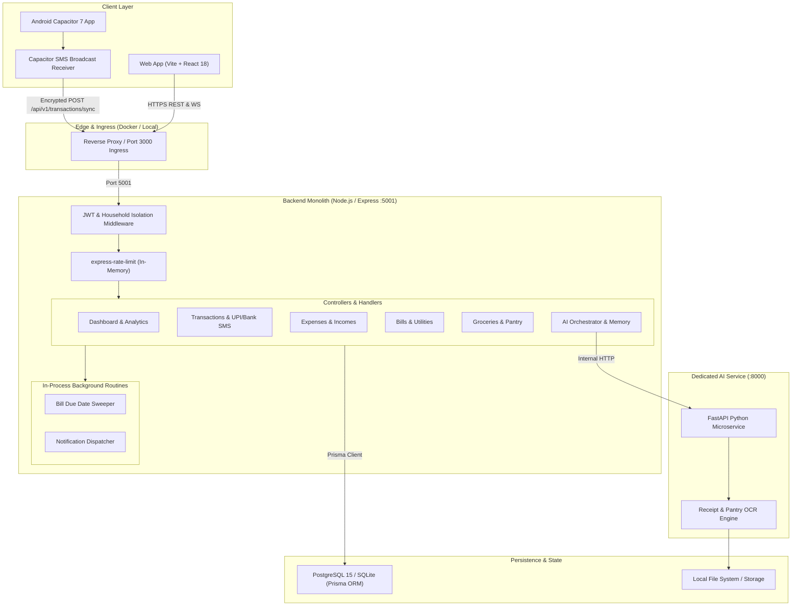

# HomeMind AI — Current State Architecture & System Audit

**Document Version:** 1.0.0  
**Status:** Active  
**Author:** HomeMind Engineering & Architecture Team  
**Last Updated:** October 2026  

---

## 1. Executive Summary

HomeMind AI is a full-stack household intelligence, family chore, and personal finance management platform. It offers real-time financial ledger tracking, automated bank and UPI SMS transaction parsing, grocery/pantry management, appliance lifecycle monitoring, recurring bill tracking, and an AI-powered conversational household copilot.

The platform is presently structured as a semi-coupled multi-directory project with:
- A client layer (Vite + React 18 + Capacitor 7 Android)
- A central monolith backend (Node.js + Express + Prisma ORM)
- A dedicated microservice (Python + FastAPI for OCR and machine learning tasks)
- Persistence layers (PostgreSQL in production/Docker, SQLite during localized zero-setup testing)

This document provides a rigorous architectural audit of the system as it operates today, detailing data flows, component boundaries, scalability bottlenecks, single points of failure (SPOFs), and architectural debt.

---

## 2. As-Is Architectural Topology

---

## 3. Component Inventory & Technology Stack

| Layer | Component | Technology / Framework | Current State & Responsibilities |
| :--- | :--- | :--- | :--- |
| **Frontend Web** | Web Application | React 18.2, TypeScript 5, Vite 5, Tailwind CSS 3.4 | Single Page Application (SPA), rich dashboard, responsive sidebars, theme management, Zustand store, TanStack React Query. |
| **Mobile Client** | Android Container | Capacitor 7, Android SDK 34 | Wraps Web SPA with native capabilities, specifically Android SMS BroadcastReceiver for auto UPI/bank transaction detection. |
| **Backend API** | Monolithic Gateway | Node.js 20, Express 4.18, TypeScript | Handles `/api/v1/*` REST routes, JWT token issuance & verification, household isolation, rate limiting, and business logic. |
| **AI Copilot** | Orchestration & Memory | Node.js AI Service + Gemini API | In-process agentic pipeline combining dynamic household context, user memories, and tool executions. |
| **Vision Microservice** | AI OCR Engine | Python 3.11, FastAPI, Tesseract / Torch | Containerized Python service receiving image payloads for item identification and receipt parsing. |
| **ORM & Database** | Data Access Layer | Prisma 5.x, PostgreSQL 15 (Docker) / SQLite (Dev) | Relational schema with 30+ models covering households, transactions, bills, inventory, appliances, and notifications. |
| **Infrastructure** | Container Orchestration | Docker, Docker Compose 3.8 | Localized multi-container setup running postgres, backend, and ai-service. |

---

## 4. Multi-Tenancy & Data Isolation Model

HomeMind employs a **Row-Level Shared-Database Multi-Tenant Isolation Model**:
1. Every tenant is represented by a `Household` record (`id: UUID`).
2. Users belong to a `Household` through a foreign key `householdId` and hold roles: `OWNER`, `CO-OWNER`, `ADMIN`, `MEMBER`, `GUEST`.
3. Ingress requests pass through `authenticate`, `attachHousehold`, and `validateSession` middlewares in `backend/src/middleware/auth.ts`:
   - `userId` and `householdId` are extracted strictly from verified JWT payloads.
   - Client-provided `householdId` in request query or body parameters is discarded to prevent Broken Object Level Authorization (BOLA / IDOR).
4. Every database write and query enforces an explicit `where: { householdId }` clause via Prisma.

---

## 5. Transaction & SMS Parsing Pipeline (Current Flow)

The automated financial tracking operates through a multi-stage parser:
1. **Device Interception**: The Android Capacitor app intercepts incoming SMS messages from approved Indian banking and UPI sender headers (e.g., `HDFCBK`, `SBIINB`, `ICICIB`, `AXISBK`, `PAYTM`, `GPAY`).
2. **Payload Submission**: Raw text, timestamp, and sender header are batched and posted to `/api/v1/transactions/sync`.
3. **Regex Extraction Engine**:
   - `backend/src/services/transactionCategorizer.ts` matches patterns for debits, credits, amounts (`INR / ₹`), merchant names, and account balance indicators.
4. **Idempotency & Deduplication**:
   - Computed hash based on `sender + amount + timestamp + referenceId` prevents duplicate entries across multi-part SMS or repeated sync operations.
5. **Approval State Machine**:
   - High-confidence matches are recorded as `AUTO_IMPORTED`.
   - Ambiguous messages are marked `PENDING_APPROVAL` with a counter in the web/mobile interface for user verification.

---

## 6. Current Technical Debt & Scalability Bottlenecks

### 6.1. Monolithic In-Process Execution (Lack of Worker Pool)
- Background routines such as SMS batch processing, bill expiration cron jobs, and notification dispatches execute directly inside the Express event loop.
- High volume SMS bursts or heavy report aggregations directly degrade HTTP API latency for active users.

### 6.2. In-Memory State & Rate Limiting
- `express-rate-limit` currently maintains counter state in local Node process memory.
- Horizontal scaling across multiple container instances is impossible without causing divergent rate-limit counters and broken user sessions.

### 6.3. Code Sharing & Monorepo Deficit
- Type definitions (`Transaction`, `Expense`, `Household`, `UserRole`) and validation schemas (Zod) are duplicated between `frontend/src/types` and `backend/src/utils/validators.ts`.
- There is no unified build orchestrator (such as Turborepo or pnpm workspaces) linking dependencies between frontend, backend, and auxiliary services.

### 6.4. Database Concurrency & Connection Starvation
- Prisma Client manages connection pools locally per Node instance.
- Without an intermediate connection pooler (such as PgBouncer), scaling to tens of instances will exhaust PostgreSQL's `max_connections` limit.

### 6.5. Observability Gaps
- Logs are currently emitted via standard stdout/console without structured JSON schemas, correlation trace IDs, or distributed APM tracking (OpenTelemetry).
- Metrics for request latency p95/p99, database query performance, and external API error rates are not collected into a centralized time-series database.

---

## 7. Migration Drivers to the Target Enterprise Architecture

To achieve production readiness for 100K+ households, the platform must transition to the enterprise architecture defined in [HLD.md](./HLD.md) and [ROADMAP.md](./ROADMAP.md):
1. **Workspace Decoupling**: Separate code into `apps/web`, `apps/api`, and `apps/worker`.
2. **Shared Package Architecture**: Establish `@homemind/shared`, `@homemind/database`, `@homemind/config`, `@homemind/validation`, and `@homemind/observability`.
3. **Asynchronous Task Offloading**: Deploy Redis BullMQ queues for SMS parsing, OCR vision inference, and notifications.
4. **Infrastructure as Code**: Formalize deployment via Docker, Kubernetes Helm charts, and Terraform cloud provisioning.
