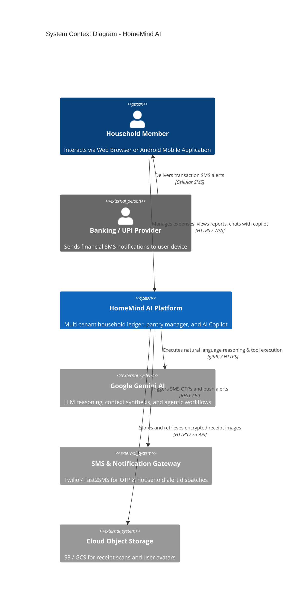
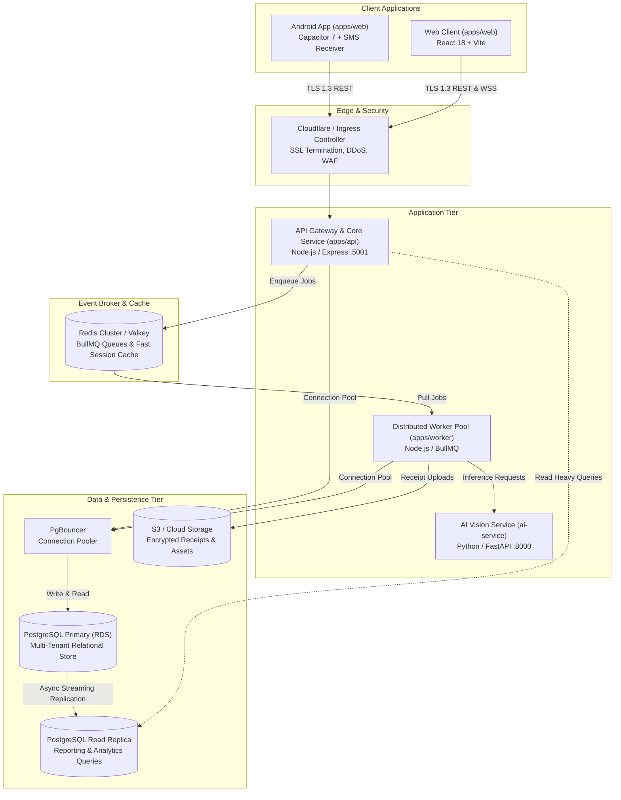
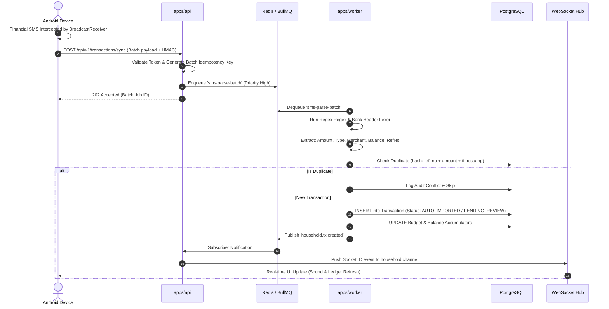

# HomeMind AI — High Level Design (HLD)

**Document Version:** 2.0.0  
**Status:** Approved Target Architecture  
**Author:** HomeMind Engineering & Architecture Team  
**Last Updated:** October 2026  

---

## 1. System Vision & Architectural Objectives

HomeMind AI is designed as a high-throughput, multi-tenant household operating system that unites personal finance, chore distribution, smart grocery replenishment, appliance monitoring, and autonomous financial SMS detection.

The target enterprise architecture evolves the system into a **modular Monorepo structure** (powered by Turborepo and pnpm workspaces), decoupling user-facing HTTP interactions from long-running background tasks, standardizing shared business logic into versioned packages, and containerizing infrastructure across cloud environments.

### Key Architectural Pillars
- **Zero-Trust Multi-Tenancy**: Guaranteed tenant boundary isolation keyed strictly on cryptographic `household_id`.
- **Event-Driven Asynchrony**: Offloading computationally expensive tasks (SMS ingestion bursts, OCR vision processing, recurring budget aggregations) to a dedicated worker pool via Redis BullMQ.
- **Strict Package Modularity**: DRY codebase with centralized validation, typed contracts, unified database models, and centralized telemetry.
- **Enterprise High Availability**: Horizontal scalability across API and worker instances with zero-downtime rolling deployments.

---

## 2. Target Monorepo Architecture Blueprint

```
HomeMind/
├── apps/
│   ├── web/                    # React 18 + Vite SPA & Android Capacitor App
│   ├── api/                    # Express + Node.js REST API & WebSocket Gateway
│   └── worker/                 # BullMQ Distributed Asynchronous Job Processor
│
├── packages/
│   ├── shared/                 # Common interfaces, DTOs, utilities, and constants
│   ├── database/               # Prisma client, migrations, seeders, and db extensions
│   ├── config/                 # Environment schemas, global configs, and feature flags
│   ├── validation/             # Shared Zod validation schemas for API & UI
│   └── observability/          # OpenTelemetry instrumentation, Winston logger, metrics
│
├── infra/
│   ├── docker/                 # Production multi-stage Dockerfiles & local compose files
│   ├── kubernetes/             # Helm charts, Kube manifests, ingress, and HPA policies
│   └── terraform/              # Cloud infrastructure provisioning (AWS/GCP, RDS, ElastiCache)
│
└── docs/                       # Architectural, operational, and performance blueprints
```

---

## 3. C4 Architecture Specification

### 3.1. Level 1: System Context Diagram



---

### 3.2. Level 2: Container Diagram



---

## 4. Subsystems & Data Ingestion Pipelines

### 4.1. Real-Time Bank & UPI SMS Transaction Ingestion

The SMS pipeline provides autonomous financial accounting with guaranteed idempotency:



### 4.2. Receipt & Pantry Vision OCR Pipeline
1. Client uploads an image of an invoice, grocery receipt, or pantry shelf.
2. `apps/api` generates a pre-signed S3 upload URL.
3. Once uploaded, `apps/api` enqueues an `ocr-receipt-job` in Redis.
4. `apps/worker` retrieves the image, invokes the FastAPI Vision microservice, normalizes line items and currency values, and upserts parsed inventory items directly into `GroceryItem` records.

### 4.3. AI Copilot & Context Synthesis Engine
- The Copilot coordinates user prompts with an in-memory knowledge retrieval layer.
- Relevant household records (recent transactions, active bills, budget limits, user chores) are compiled into structured JSON contexts.
- Multi-turn conversational memories are stored under `AIMemory` and `AIThread` tables for personalized, context-aware household recommendations.

---

## 5. Security & Isolation Architecture

1. **Authentication Token Lifecycle**:
   - Access Token: Short-lived HMAC-SHA256 JWT (15-minute expiry).
   - Refresh Token: Long-lived opaque string (7-day expiry) stored in an `HttpOnly`, `Secure`, `SameSite=Strict` cookie, tracked in the `RefreshToken` database table with device footprint fingerprints.
2. **Tenant Perimeter**:
   - Every internal service method signature requires `householdId: string` as the first argument.
   - Database queries utilize Prisma Client extensions that inject `where: { householdId }` automatically into all multi-tenant queries.
3. **Data Protection at Rest & In Transit**:
   - TLS 1.3 enforced across all ingress and inter-service communications.
   - PII fields (phone numbers, account references) encrypted using AES-256-GCM.

---

## 6. High Availability & Fault Tolerance Patterns

- **Circuit Breakers**: External integrations (Twilio, Fast2SMS, Gemini API) are wrapped with circuit breakers (opossum) to prevent cascading thread pool exhaustion.
- **Exponential Backoff with Jitter**: All worker jobs retry failed tasks up to 5 times before shunting them to a Dead-Letter Queue (DLQ).
- **Read/Write Splitting**: Read-heavy queries (historical analytics, yearly financial reports) target PostgreSQL read replicas, insulating the write-primary from resource contention.
- **Horizontal Pod Autoscaling (HPA)**: Kubernetes clusters scale `apps/api` based on CPU (>70%) and concurrent connections, and scale `apps/worker` based on Redis queue depth.
