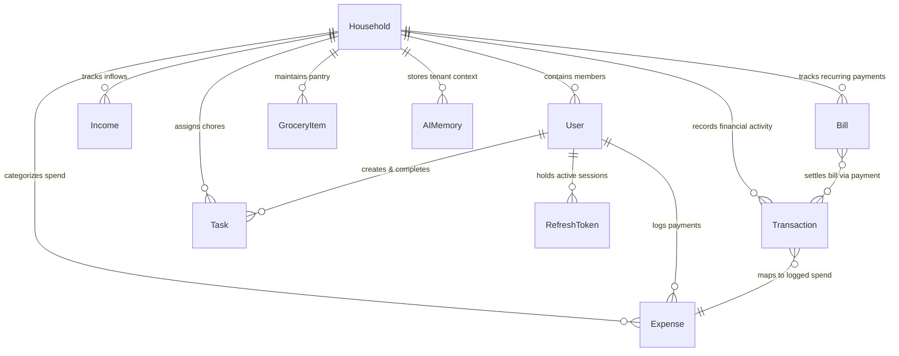
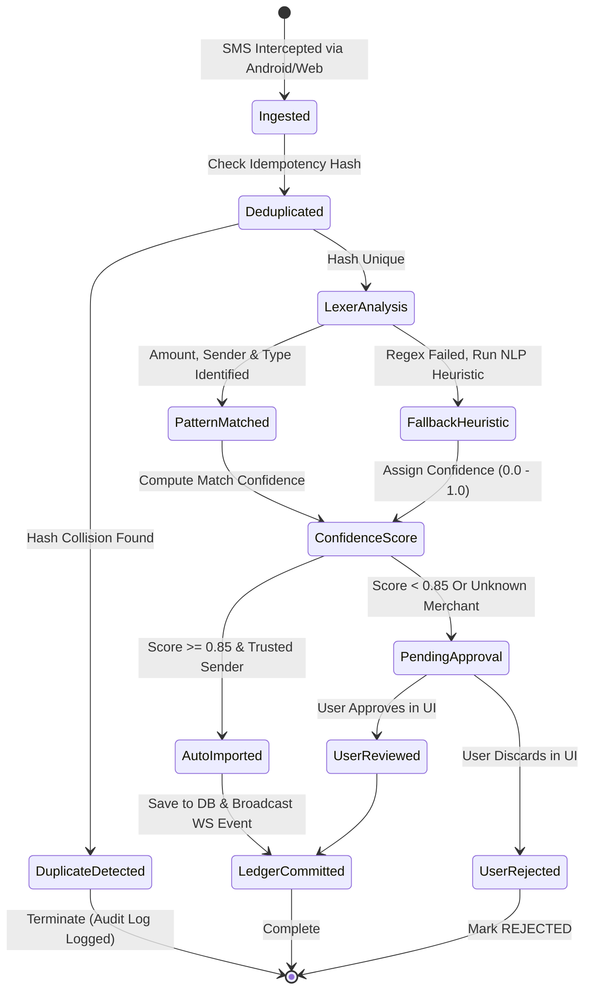

# HomeMind AI — Low Level Design (LLD)

**Document Version:** 2.0.0  
**Status:** Approved  
**Author:** HomeMind Engineering & Architecture Team  
**Last Updated:** October 2026  

---

## 1. Domain Model & Prisma Schema Specifications

The relational schema is maintained under `packages/database`. The primary entities enforce strict relational constraints, composite indices, and cascading lifecycle policies.

### 1.1. Core Multi-Tenant Entity Diagram



### 1.2. Key Entity Fields & Concurrency Constraints

```prisma
model Transaction {
  id              String             @id @default(uuid())
  householdId     String
  household       Household          @relation(fields: [householdId], references: [id], onDelete: Cascade)
  userId          String?
  user            User?              @relation(fields: [userId], references: [id], onDelete: SetNull)
  amount          Float
  currency        String             @default("INR")
  type            String             // DEBIT, CREDIT
  source          String             // SMS, MANUAL, BANK_FEED, QR_SCAN
  senderHeader    String?            // e.g. "HDFCBK", "SBIINB", "PAYTM"
  rawText         String?
  referenceId     String?            // UTR / UPI reference ID / Bank ref
  merchant        String?
  category        String?
  balanceAfter    Float?
  status          String             @default("AUTO_IMPORTED") // PENDING_APPROVAL, REVIEWED, AUTO_IMPORTED, REJECTED
  idempotencyHash String             @unique
  timestamp       DateTime
  createdAt       DateTime           @default(now())
  updatedAt       DateTime           @updatedAt

  @@index([householdId, timestamp(sort: Desc)])
  @@index([householdId, status])
  @@index([idempotencyHash])
}
```

---

## 2. Bank & UPI SMS Parser Lexer & State Machine

The transaction processing engine extracts semantic entities from unstructured SMS text streams.

### 2.1. State Machine Workflow



### 2.2. Deterministic Idempotency Key Computation

To guarantee zero duplicate ledger entries under network retry bursts, the `idempotencyHash` is generated via SHA-256:

$$\text{Hash} = \text{SHA256}(\text{householdId} + \text{senderHeader} + \text{amount} + \text{timestamp.toISOString()} + \text{referenceId})$$

```typescript
// packages/shared/src/utils/crypto.ts
import { createHash } from 'crypto';

export function computeTransactionHash(params: {
  householdId: string;
  senderHeader: string;
  amount: number;
  timestamp: Date;
  referenceId?: string;
}): string {
  const normalizedRef = (params.referenceId || '').trim().toLowerCase();
  const rawPayload = [
    params.householdId,
    params.senderHeader.toUpperCase().trim(),
    params.amount.toFixed(2),
    params.timestamp.toISOString(),
    normalizedRef,
  ].join('::');

  return createHash('sha256').update(rawPayload).digest('hex');
}
```

---

## 3. Automated Tenant Isolation via Prisma Client Extension

To prevent accidental data leakage across tenant boundaries, `packages/database` exports an extended Prisma Client with query lifecycle hooks:

```typescript
// packages/database/src/client.ts
import { PrismaClient } from '@prisma/client';

export function createTenantPrismaClient(householdId: string) {
  const baseClient = new PrismaClient();

  return baseClient.$extends({
    query: {
      $allModels: {
        async findMany({ args, query }) {
          args.where = { ...args.where, householdId };
          return query(args);
        },
        async findFirst({ args, query }) {
          args.where = { ...args.where, householdId };
          return query(args);
        },
        async count({ args, query }) {
          args.where = { ...args.where, householdId };
          return query(args);
        },
        async create({ args, query }) {
          args.data = { ...args.data, householdId };
          return query(args);
        },
      },
    },
  });
}
```

---

## 4. Asynchronous Task Worker Specifications (`apps/worker`)

Distributed jobs are managed using **BullMQ** backed by Redis.

### 4.1. Queue Topology & Concurrency Controls

| Queue Name | Concurrency | Priority Levels | Failure Strategy | Retry Backoff |
| :--- | :--- | :--- | :--- | :--- |
| `sms-ingest-queue` | 10 per instance | 1 (Urgent) | Exponential Backoff | 5 attempts, initial delay 2s |
| `ocr-receipt-queue`| 4 per instance  | 2 (Normal) | Exponential Backoff | 3 attempts, initial delay 5s |
| `bill-sweeper-queue`| 2 per instance | 3 (Batch)  | Log & Alert DLQ     | 3 attempts, initial delay 10s |
| `notif-fanout-queue`| 20 per instance| 1 (Urgent) | Dead-Letter Queue   | 5 attempts, initial delay 1s |

### 4.2. Worker Job Handler Implementation Pattern

```typescript
// apps/worker/src/processors/smsProcessor.ts
import { Job, Worker } from 'bullmq';
import { prisma } from '@homemind/database';
import { categorizeSmsText } from '@homemind/shared';
import { logger } from '@homemind/observability';

export const smsWorker = new Worker(
  'sms-ingest-queue',
  async (job: Job) => {
    const { householdId, userId, smsBatch } = job.data;
    logger.info('Processing SMS batch', { jobId: job.id, householdId, count: smsBatch.length });

    for (const rawMessage of smsBatch) {
      const parsed = categorizeSmsText(rawMessage.body, rawMessage.sender);
      if (!parsed.isFinancial) continue;

      const hash = computeTransactionHash({
        householdId,
        senderHeader: rawMessage.sender,
        amount: parsed.amount,
        timestamp: new Date(rawMessage.timestamp),
        referenceId: parsed.refNumber,
      });

      try {
        await prisma.transaction.create({
          data: {
            householdId,
            userId,
            amount: parsed.amount,
            type: parsed.type,
            source: 'SMS',
            senderHeader: rawMessage.sender,
            rawText: rawMessage.body,
            referenceId: parsed.refNumber,
            merchant: parsed.merchant,
            category: parsed.category,
            status: parsed.confidence > 0.85 ? 'AUTO_IMPORTED' : 'PENDING_APPROVAL',
            idempotencyHash: hash,
            timestamp: new Date(rawMessage.timestamp),
          },
        });
      } catch (err: any) {
        if (err.code === 'P2002') {
          logger.debug('Duplicate SMS transaction suppressed', { hash });
          continue;
        }
        throw err;
      }
    }
  },
  { connection: redisConnection, concurrency: 10 }
);
```

---

## 5. API Response Contracts & Standard Errors

Every REST endpoint follows the standard JSend / OpenAPI compliant envelope:

```typescript
// packages/shared/src/types/api.ts
export interface ApiResponse<T> {
  success: boolean;
  data?: T;
  error?: {
    code: string;       // e.g. "TENANT_ACCESS_DENIED", "VALIDATION_FAILED"
    message: string;
    details?: Record<string, any>;
  };
  metadata?: {
    timestamp: string;
    requestId: string;
    processingTimeMs: number;
  };
}
```
