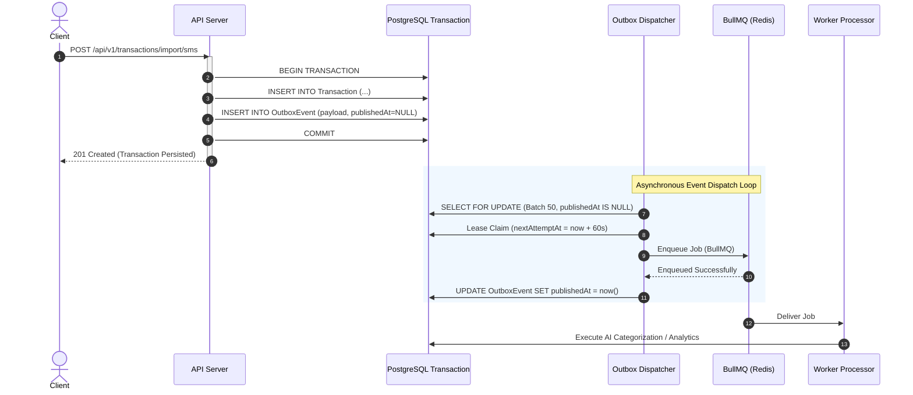

# Transactional Outbox Architecture & Implementation

**Status:** Production Standard  
**Last Updated:** October 2, 2026  
**Component:** `@homemind/database`, `apps/api/src/infrastructure/outbox`, `apps/worker/src/outbox`

---

## 1. Problem Statement & Dual-Write Vulnerability

In distributed architectures, persisting a business entity to PostgreSQL and simultaneously publishing an event or job to an external message broker (such as Redis/BullMQ or Kafka) suffers from the **Dual-Write Problem**:

```
        API Request
             │
             ▼
    ┌─────────────────┐
    │ 1. DB Insert    │  ──► Succeeded
    └─────────────────┘
             │
             ▼
    ┌─────────────────┐
    │ 2. Queue Publish│  ──► FAILS (Network timeout, Redis failover, process crash)
    └─────────────────┘
             │
             ▼
    Result: Ghost Mutation (Data in DB, event never delivered)
```

If the database write succeeds but the queue publish fails, downstream systems (AI categorization, analytics aggregations, bill alerts, cache invalidations) never receive the event. If the order is reversed, events fire for database writes that subsequently rolled back.

---

## 2. Target Solution: The Transactional Outbox Pattern

The **Transactional Outbox Pattern** eliminates dual-writes by storing the event in an `OutboxEvent` table **inside the same database transaction** that creates the domain entity:



---

## 3. Data Model

The `OutboxEvent` table schema in `packages/database/prisma/schema.prisma`:

```prisma
model OutboxEvent {
  id            String    @id @default(uuid())
  eventId       String    @unique
  eventType     String    // e.g. finance.expense.created.v1, finance.transaction.created.v1
  aggregateType String    // e.g. Expense, Transaction, Bill, Income
  aggregateId   String
  householdId   String?
  payload       String    // JSON-serialized domain event envelope
  createdAt     DateTime  @default(now())
  publishedAt   DateTime?
  attempts      Int       @default(0)
  lastError     String?
  nextAttemptAt DateTime?

  @@index([publishedAt, nextAttemptAt, createdAt])
  @@index([householdId])
  @@index([aggregateType, aggregateId])
}
```

---

## 4. Dispatcher Claim Strategy & Concurrency Safety

To prevent multiple worker instances from claiming and dispatching the same outbox row:

1. **Candidate Query:** The dispatcher queries up to `OUTBOX_BATCH_SIZE` (default 50) rows where `publishedAt IS NULL` and `attempts < OUTBOX_MAX_ATTEMPTS` and (`nextAttemptAt IS NULL` or `nextAttemptAt <= now()`).
2. **Atomic Lease Claim:** The worker atomically executes `UPDATE OutboxEvent SET nextAttemptAt = now() + 60s WHERE id = :id AND publishedAt IS NULL AND ...`. If another worker raced and claimed the row, the count is 0 and it is skipped.
3. **Queue Publish:** The event is pushed into the BullMQ queue matching its topic (`ai`, `notifications`, `analytics`).
4. **Publication Confirmation:** Only after BullMQ acknowledges the job is `publishedAt = new Date()` stamped.
5. **Backoff on Failure:** If the queue is unreachable (e.g. Redis downtime), the row is left unpublished, `attempts` is incremented, and `nextAttemptAt` is set with exponential backoff:
   $$\text{delay} = \min(2^{\text{attempts}} \times 1000\text{ ms}, 60000\text{ ms})$$

---

## 5. Event Envelope Standard

All outbox event payloads adhere to the versioned envelope contract defined in `@homemind/shared`:

```json
{
  "eventId": "f7d9a3b2-6712-4d2a-89a1-0947230182bb",
  "eventType": "finance.transaction.created.v1",
  "occurredAt": "2026-10-02T00:55:00.000Z",
  "aggregateType": "Transaction",
  "aggregateId": "tx-883921",
  "householdId": "11111111-1111-1111-1111-111111111111",
  "version": 1,
  "data": {
    "id": "tx-883921",
    "amount": 1450.00,
    "currency": "INR",
    "type": "DEBIT",
    "merchant": "Swiggy",
    "category": "Food & Dining",
    "status": "CONFIRMED"
  }
}
```

---

## 6. Failure & Resilience Matrix

| Scenario | Database State | Outbox State | Redis State | Behavior |
| :--- | :--- | :--- | :--- | :--- |
| **Normal Operation** | Committed | `publishedAt` stamped | Job queued | End-to-end async processing |
| **Redis Offline** | Committed | `publishedAt = NULL`, retries scheduled | Down | Core DB write succeeds; events await Redis recovery |
| **Worker Crash** | Committed | Lease expires in 60s | Idle | Another worker picks up event automatically |
| **Max Retries Exceeded**| Committed | `attempts = 5`, alert logged | Failed | Moves to dead-letter log for administrative inspection |
