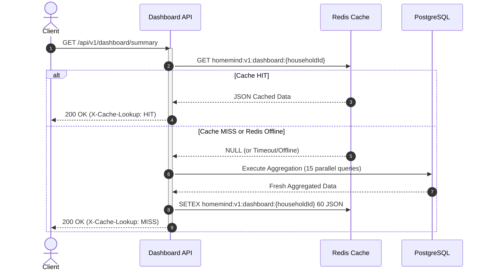
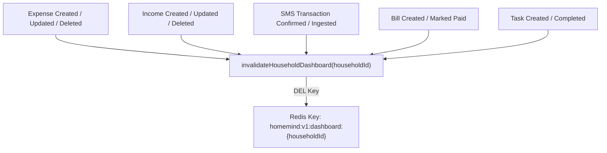

# Redis Caching & Invalidation Architecture

**Version:** 2.0.0  
**Status:** Implemented (Phase 2)  
**Location:** `apps/api/src/infrastructure/redis`, `apps/api/src/modules/dashboard`

---

## 1. Overview & Objectives

In Phase 1, `GET /api/v1/dashboard/summary` executed 15 complex relational SQL queries in parallel on every single page load or refresh. Under high concurrent user activity, this exhausted database connection pools and increased p95 latency.

In Phase 2, Redis is introduced as a high-performance distributed cache for dashboard telemetry, rate limits, and deduplication states, backed by strict multi-tenant key isolation and event-driven cache invalidation.

---

## 2. Key Namespacing Standard

To prevent key collision and ensure strict multi-tenant isolation, all Redis keys are constructed using the helper:

$$\text{buildCacheKey}(namespace, \dots parts) \implies \text{homemind:v1}:namespace:\dots parts$$

### Key Patterns
| Scope | Pattern | TTL | Usage |
| :--- | :--- | :--- | :--- |
| **Dashboard** | `homemind:v1:dashboard:{householdId}` | 60s | Cached household summary payload |
| **Rate Limiter** | `homemind:v1:rate-limit:{scope}:{identity}` | 900s | Distributed request windows |
| **Idempotency** | `homemind:v1:idempotency:{householdId}:{key}` | 86400s | Lookup cache for completed requests |
| **Notification Dedup**| `homemind:v1:notif-dedup:{householdId}:{dedupKey}`| 3600s | Prevention of spam during retries |

> [!CAUTION]
> **Tenant Security Rule:** Keys containing household-scoped data MUST NEVER omit `{householdId}`. Storing generic keys like `homemind:v1:dashboard` is strictly prohibited.

---

## 3. Dashboard Cache Flow



---

## 4. Event-Driven Cache Invalidation

Relying solely on TTL introduces stale reads where a user adds an expense but still sees the old balance for up to 60 seconds.

HomeMind implements **active event-driven cache invalidation**: whenever any financial or task mutation occurs, `invalidateHouseholdDashboard(householdId)` is immediately triggered:



### Invalidation Helper
```typescript
export async function invalidateHouseholdDashboard(householdId: string): Promise<void> {
  const key = buildCacheKey('dashboard', householdId);
  await redis.del(key);
}
```

---

## 5. Resilience & In-Memory Fallback

If Redis becomes unreachable:
1. `RedisService` catches connection errors without throwing unhandled exceptions.
2. In-memory `Map<string, { value: string, expiresAt: number }>` acts as a transparent local fallback during single-node local development.
3. If both Redis and memory fail, the API directly executes the PostgreSQL aggregation queries.
4. **Result:** A Redis outage causes a slight increase in database load, but **zero downtime or 500 errors for end users**.
