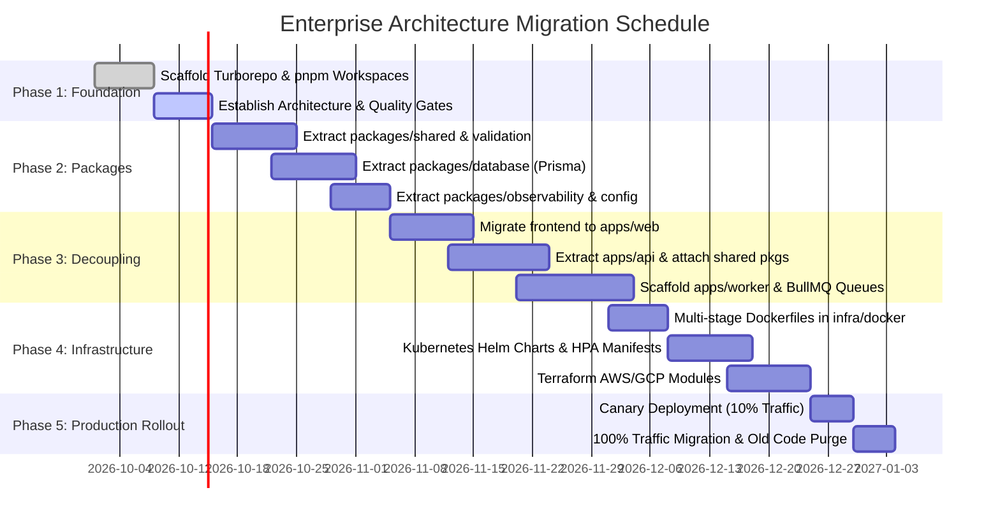

# HomeMind AI — Architectural Migration Roadmap

**Document Version:** 2.0.0  
**Status:** Approved  
**Author:** HomeMind Engineering & Architecture Team  
**Last Updated:** October 2026  

---

## 1. Migration Overview & Strategic Principles

To evolve HomeMind from a semi-coupled project into an enterprise-grade multi-tenant platform capable of serving millions of households, the engineering organization is executing a phased **Strangler Fig Migration**.

### Non-Negotiable Guarantees
- **Zero Production Downtime**: API routes and mobile sync endpoints must maintain uninterrupted availability.
- **Strict Backward Compatibility**: The Android Capacitor client cannot be forced into breaking API updates.
- **Atomic Milestones**: Each phase contains explicit acceptance tests, verifiable exit criteria, and automated rollback scripts.

---

## 2. High-Level Migration Gantt

---

## 3. Phase-by-Phase Execution Details

### Phase 1: Monorepo Foundation & Tooling (Sprint 1 - 2)
- **Objective:** Establish workspace orchestration without altering runtime behavior.
- **Deliverables:**
  - Install `pnpm` workspaces and configure root `pnpm-workspace.yaml`.
  - Add root `turbo.json` with pipeline definitions (`build`, `dev`, `lint`, `test`, `typecheck`).
  - Standardize root TypeScript configurations (`tsconfig.base.json`).
  - Configure ESLint, Prettier, and Husky pre-commit hooks for monorepo validation.
- **Exit Criteria:** `pnpm build` and `pnpm lint` succeed across all workspace roots with pipeline caching.

---

### Phase 2: Core Shared Packages Extraction (Sprint 3 - 5)
- **Objective:** Eliminate code duplication and create versioned internal libraries.
- **Deliverables:**
  1. `packages/validation`: Consolidate all Zod schemas (Auth, Transactions, Bills, Inventory, Settings).
  2. `packages/shared`: Common interfaces, DTOs, currency formatters, SMS parsing lexers, and error types.
  3. `packages/database`: Relational Prisma schema, client generation, migration runners, and automated tenant isolation extensions.
  4. `packages/config`: Type-safe environment validation with `@t3-oss/env-core`.
  5. `packages/observability`: Structured JSON logging (Winston), OpenTelemetry tracers, and Prometheus metrics.
- **Exit Criteria:** Zero type drift between frontend and backend; all validation tests pass against standalone packages.

---

### Phase 3: Application Decoupling & Worker Pool (Sprint 6 - 8)
- **Objective:** Separate HTTP ingestion from asynchronous background processing.
- **Deliverables:**
  1. Relocate `frontend/` to `apps/web` with updated internal package references.
  2. Relocate `backend/` to `apps/api` with controllers consuming `@homemind/database` and `@homemind/validation`.
  3. Scaffold `apps/worker` using BullMQ.
  4. Move SMS batch processing, bill notifications, and OCR jobs out of `apps/api` into `apps/worker`.
- **Exit Criteria:** `apps/api` handles 500 QPS with p95 latency under 80ms while worker jobs process concurrently in the background.

---

### Phase 4: Production Infrastructure as Code (Sprint 9 - 10)
- **Objective:** Enable automated container builds, orchestration, and cloud infrastructure management.
- **Deliverables:**
  1. `infra/docker`: Optimized multi-stage Dockerfiles using Alpine and unprivileged non-root users.
  2. `infra/kubernetes`: Production Helm charts with Ingress, Service, ConfigMap, Secret, and HPA definitions.
  3. `infra/terraform`: Infrastructure as Code templates for RDS PostgreSQL, ElastiCache Redis, S3 buckets, and VPC networking.
- **Exit Criteria:** Clean cluster bootstrap from `terraform apply` and `helm install` in a staging environment.

---

### Phase 5: Production Rollout & Zero-Downtime Cutover (Sprint 11)
- **Objective:** Safely route production traffic to the new modular architecture.
- **Deliverables:**
  - Route 5% of web and API traffic via Cloudflare Canary routing rules.
  - Monitor error budgets, p99 latencies, and worker queue processing times.
  - Incrementally ramp to 25%, 50%, and 100% over 5 business days.
  - Archive obsolete single-directory legacy configs.
- **Exit Criteria:** 100% production traffic running on `apps/api` and `apps/worker` with zero regression in SMS auto-detection accuracy.

---

## 4. Risk Matrix & Mitigation Strategies

| Risk | Likelihood | Impact | Mitigation Strategy |
| :--- | :--- | :--- | :--- |
| **Prisma Package Resolution Conflicts** | Medium | High | Use `preserveSymlinks` in tsconfig and isolate Prisma client generation into a dedicated build target. |
| **SMS Ingestion Message Drop during Cutover** | Low | Critical | Dual-write Redis queues during canary cutover; ensure idempotency hashes prevent duplicates. |
| **Capacitor Mobile Build Breakage** | Medium | High | Keep mobile build scripts pinned to `apps/web/android` with automated CI matrix checks. |
| **Memory Leaks in Background Worker** | Medium | Medium | Configure BullMQ worker process recycling (`maxJobsPerWorker`) and set Kubernetes container memory limits. |
