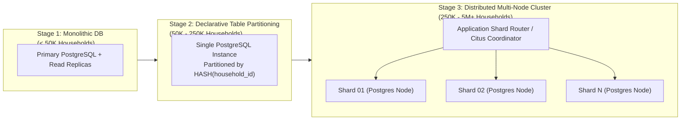
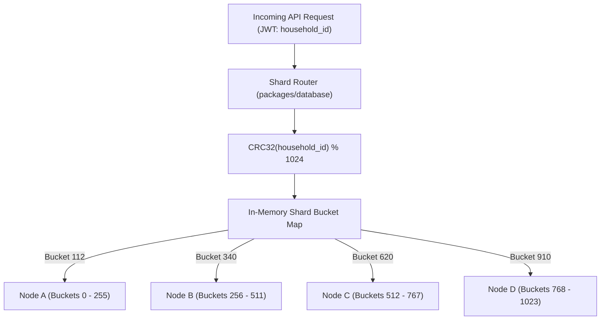
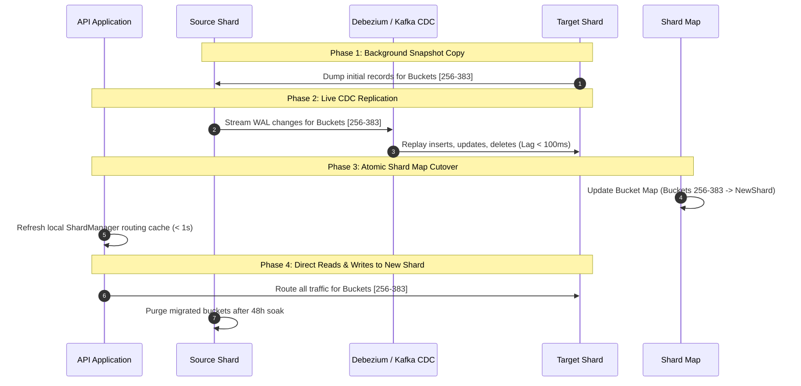

# HomeMind AI — Multi-Tenant Database Sharding Strategy

**Document Version:** 2.0.0  
**Status:** Approved  
**Author:** HomeMind Data Architecture Team  
**Last Updated:** October 2026  

---

## 1. Context & Sharding Rationale

In HomeMind AI, household operations are inherently isolated:
- A user querying their expense ledger, bill schedule, grocery inventory, or AI recommendations strictly accesses records belonging to their assigned `household_id`.
- Inter-household queries (e.g., joining Household A's transactions with Household B's bills) **never occur**.

This natural domain boundary makes **Tenant-Based Partitioning on `household_id`** the optimal scaling pattern. It allows horizontal scaling across multiple independent database nodes while retaining strict transactional consistency (ACID) within every individual household.

---

## 2. Multi-Stage Sharding Evolution



---

## 3. Shard Key & Entity Co-Location

To guarantee that queries never span multiple physical nodes, all child entities inherit and index the shard key:

$$\text{Shard Key} = \text{household\_id} \quad (\text{UUIDv4})$$

### Co-Located Entities (Colocated on the Same Physical Shard)
- `Household`
- `Transaction`
- `Expense` & `ExpenseCategory`
- `Income`
- `Bill` & `BillCategory`
- `GroceryItem` & `InventoryHistory`
- `Appliance` & `MaintenanceLog`
- `Medicine` & `MedicineDose`
- `Task`
- `Notification`
- `AIMemory` & `AIThread`

### Global (Non-Sharded / Replicated) Entities
- `User`: Stored in a central **Global Catalog Database** to permit cross-household member invites and global authentication lookups via email or phone number.
- `OTPVerification`: Ephemeral, stored in fast Redis key-value store.
- `GlobalCurrencies` & `SystemConfigs`: Cached in Redis and replicated across all shards.

---

## 4. Tenant Routing Strategies

### 4.1. Consistent Hashing via Virtual Buckets (Selected Strategy)

To decouple physical server nodes from tenant assignments and allow rebalancing with minimal data relocation, HomeMind uses **Consistent Hashing with 1,024 Virtual Buckets**:

$$\text{Bucket ID} = \text{CRC32}(\text{household\_id}) \pmod{1024}$$



### 4.2. Shard Router Implementation Pattern

```typescript
// packages/database/src/sharding/router.ts
import { crc32 } from 'zlib';
import { PrismaClient } from '@prisma/client';

export interface ShardNodeConfig {
  id: string;
  connectionUrl: string;
  assignedBuckets: [number, number]; // [min, max] inclusive
}

export class ShardManager {
  private static shardNodes: Map<string, PrismaClient> = new Map();
  private static bucketMap: ShardNodeConfig[] = [];

  public static initialize(configs: ShardNodeConfig[]) {
    this.bucketMap = configs;
    for (const config of configs) {
      this.shardNodes.set(config.id, new PrismaClient({ datasourceUrl: config.connectionUrl }));
    }
  }

  public static getClientForTenant(householdId: string): PrismaClient {
    const hash = crc32(householdId);
    const bucket = hash % 1024;

    const matchedConfig = this.bucketMap.find(
      (node) => bucket >= node.assignedBuckets[0] && bucket <= node.assignedBuckets[1]
    );

    if (!matchedConfig) {
      throw new Error(`No shard assigned for bucket ${bucket}`);
    }

    return this.shardNodes.get(matchedConfig.id)!;
  }
}
```

---

## 5. PostgreSQL Native Declarative Partitioning Blueprint

During Stage 2 (50K - 250K households), native PostgreSQL declarative table partitioning is implemented:

```sql
-- Create Partitioned Transaction Table
CREATE TABLE transactions (
    id UUID NOT NULL,
    household_id UUID NOT NULL,
    user_id UUID,
    amount NUMERIC(12, 2) NOT NULL,
    type VARCHAR(16) NOT NULL,
    source VARCHAR(32) NOT NULL,
    raw_text TEXT,
    reference_id VARCHAR(64),
    merchant VARCHAR(128),
    category VARCHAR(64),
    status VARCHAR(32) NOT NULL DEFAULT 'AUTO_IMPORTED',
    idempotency_hash VARCHAR(64) NOT NULL,
    timestamp TIMESTAMPTZ NOT NULL,
    created_at TIMESTAMPTZ NOT NULL DEFAULT NOW(),
    updated_at TIMESTAMPTZ NOT NULL DEFAULT NOW(),
    PRIMARY KEY (id, household_id)
) PARTITION BY HASH (household_id);

-- Create 16 Hash Partitions
CREATE TABLE transactions_part_00 PARTITION OF transactions FOR VALUES WITH (MODULUS 16, REMAINDER 0);
CREATE TABLE transactions_part_01 PARTITION OF transactions FOR VALUES WITH (MODULUS 16, REMAINDER 1);
-- ... (partitions 02 through 14)
CREATE TABLE transactions_part_15 PARTITION OF transactions FOR VALUES WITH (MODULUS 16, REMAINDER 15);

-- Fast Indexing on Partitioned Tables
CREATE INDEX idx_trans_hh_time ON transactions (household_id, timestamp DESC);
CREATE UNIQUE INDEX uq_trans_idem ON transactions (household_id, idempotency_hash);
```

---

## 6. Zero-Downtime Shard Migration & Rebalancing

When a physical shard reaches 80% IOPS or storage thresholds, buckets are migrated to a newly provisioned node using **Dual-Writing and CDC (Change Data Capture)**:


