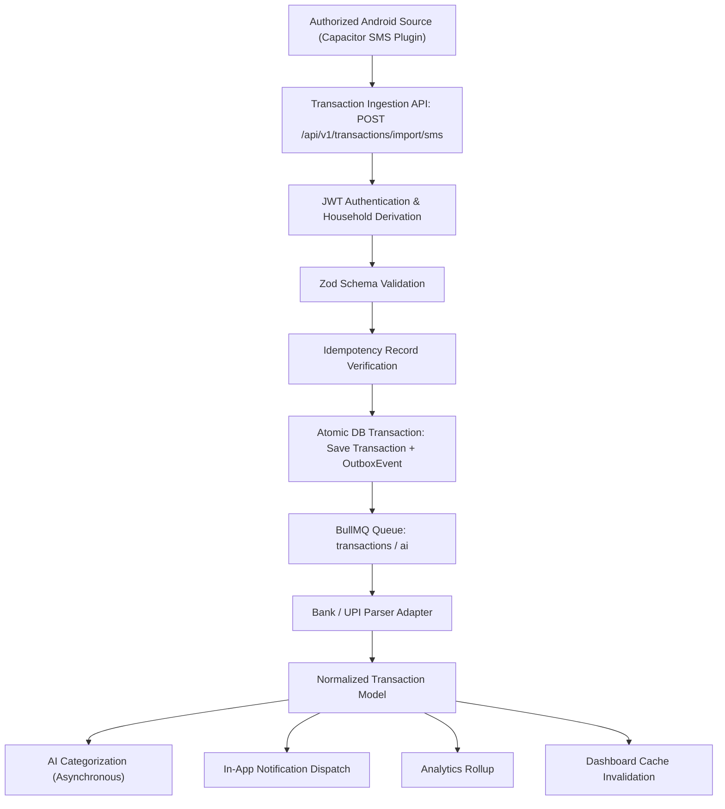
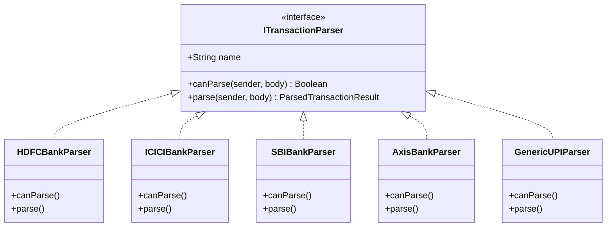

# Automated Financial Transaction Ingestion Pipeline

**Version:** 2.0.0  
**Status:** Implemented (Phase 2)  
**Modules:** `apps/api/src/modules/finance/transactions`, Android Capacitor Native Plugin

---

## 1. End-to-End Ingestion Pipeline Architecture



---

## 2. SMS Privacy & Data Sanitization Rules

To comply with mobile application privacy guidelines:
1. **Financial Filter Pre-Check:** The device or ingestion endpoint runs `FinancialSmsFilter.isFinancial(sender, body)`.
2. **Rejection of Sensitive Messages:**
   - Personal conversations (peer-to-peer mobile phone numbers) are rejected immediately.
   - Login, device registration, and password reset OTPs are dropped.
   - Pure marketing spam without financial debit/credit keywords is discarded.
3. **Account Masking:** Bank account numbers are never stored in plain text; only masked representations (e.g. `XX1234`) are retained.
4. **Temporary Raw Retention:** Raw message strings are only held for parser debugging and can be redacted or discarded after normalization.

---

## 3. Extensible Multi-Bank Parser Architecture

Rather than maintaining a single unwieldy regex file, HomeMind employs an extensible adapter strategy:



### Parser Confidence Thresholds
- **High Confidence ($\ge 0.85$):** Automatically imported with `status: CONFIRMED` and automatically links an `Expense` or `Income` record.
- **Medium Confidence ($0.60 \dots 0.84$):** Imported with `status: NEEDS_REVIEW` for one-tap user confirmation in the UI.
- **Low Confidence ($< 0.60$):** Flagged or filtered out.

---

## 4. Multi-Signal Deduplication Strategy

To prevent duplicate expenses when SMS messages are re-delivered or re-scanned:
1. **Deterministic Fingerprint (`sourceHash`):**
   $$\text{SHA-256}(\text{sender} + \text{amount} + \text{type} + \text{reference} + \text{accountLast4} + \text{timestamp})$$
2. **Database Unique Index:** `sourceHash` has a unique constraint scoped to `(sourceHash, householdId)` in Prisma schema.
3. **Idempotency Key Header:** Android sync clients send `Idempotency-Key: uuid` on sync requests. Replays return the cached response immediately.

---

## 5. Financial Money Precision

To prevent IEEE 754 floating-point inaccuracies (e.g. $0.1 + 0.2 = 0.30000000000000004$), all monetary values pass through standard rounding and minor unit conversions in `@homemind/shared`:

```typescript
// Money helper functions
export function roundMoney(amount: number): number {
  return Math.round((amount + Number.EPSILON) * 100) / 100;
}

export function toMinorUnits(amount: number): number {
  return Math.round((amount + Number.EPSILON) * 100);
}

export function fromMinorUnits(minorUnits: number): number {
  return roundMoney(minorUnits / 100);
}
```
