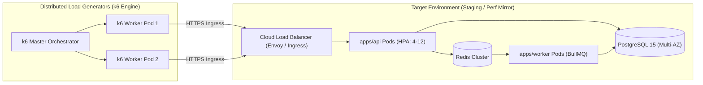

# HomeMind AI — Performance & Load Testing Specification

**Document Version:** 2.0.0  
**Status:** Approved  
**Author:** HomeMind Performance Engineering & QA Team  
**Last Updated:** October 2026  

---

## 1. Objectives & Performance Baselines

The HomeMind AI load testing harness validates system throughput, connection pool limits, queue backpressure, and p95/p99 latencies under real-world household concurrency.

### Benchmark Target Thresholds

| Test Profile | Concurrency (VUs) | Target QPS | Target p95 Latency | Target p99 Latency | Max Error Rate |
| :--- | :--- | :--- | :--- | :--- | :--- |
| **Smoke Test** | 5 VUs | ~10 QPS | $< 60\text{ ms}$ | $< 120\text{ ms}$ | $0.0\%$ |
| **Steady State** | 250 VUs | ~350 QPS | $< 120\text{ ms}$ | $< 300\text{ ms}$ | $< 0.01\%$ |
| **Stress Test** | 1,000 VUs | ~1,500 QPS | $< 350\text{ ms}$ | $< 700\text{ ms}$ | $< 0.1\%$ |
| **Spike Test** | $50 \to 2,000$ VUs (30s) | $\sim 2,800\text{ QPS}$ | $< 600\text{ ms}$ | $< 1,200\text{ ms}$ | $< 0.5\%$ |
| **Endurance / Soak**| 150 VUs | ~200 QPS | $< 120\text{ ms}$ (Flat) | $< 300\text{ ms}$ (Flat) | $< 0.01\%$ |

---

## 2. Load Testing Architecture



---

## 3. Executable k6 Test Script (`load-test.js`)

This production k6 script exercises the entire critical path: user authentication, dashboard retrieval, financial SMS sync, and ledger mutation.

```javascript
import http from 'k6/http';
import { check, sleep, group } from 'k6';
import { Rate, Trend } from 'k6/metrics';

// Custom Prometheus-compatible metrics
const errorRate = new Rate('custom_error_rate');
const smsIngestDuration = new Trend('sms_ingest_duration_ms');
const dashboardSummaryDuration = new Trend('dashboard_summary_duration_ms');

export const options = {
  stages: [
    { duration: '2m', target: 100 },  // Warm up
    { duration: '5m', target: 350 },  // Sustained peak steady-state
    { duration: '1m', target: 1000 }, // Spike to stress limit
    { duration: '3m', target: 1000 }, // Hold stress load
    { duration: '2m', target: 0 },    // Graceful ramp down
  ],
  thresholds: {
    'http_req_duration': ['p(95)<350', 'p(99)<700'],
    'custom_error_rate': ['rate<0.001'], // < 0.1% failure allowed
    'sms_ingest_duration_ms': ['p(95)<250'],
    'dashboard_summary_duration_ms': ['p(95)<120'],
  },
};

const BASE_URL = __ENV.TARGET_URL || 'https://staging-api.homemind.ai/api/v1';

export default function () {
  // Pre-seeded test credentials
  const payload = JSON.stringify({
    phoneNumber: '+919876543210',
    otp: '123456',
  });

  const headers = { 'Content-Type': 'application/json' };

  group('01. Authentication & Token Exchange', () => {
    const authRes = http.post(`${BASE_URL}/auth/phone/verify-otp`, payload, { headers });
    const isAuthOk = check(authRes, {
      'auth status is 200': (r) => r.status === 200,
      'has accessToken': (r) => r.json('data.accessToken') !== undefined,
    });
    errorRate.add(!isAuthOk);

    if (!isAuthOk) return;

    const token = authRes.json('data.accessToken');
    const authHeaders = {
      'Content-Type': 'application/json',
      'Authorization': `Bearer ${token}`,
    };

    group('02. Fetch Dashboard Telemetry', () => {
      const start = Date.now();
      const dashRes = http.get(`${BASE_URL}/dashboard/summary`, { headers: authHeaders });
      dashboardSummaryDuration.add(Date.now() - start);

      const isDashOk = check(dashRes, {
        'dashboard status is 200': (r) => r.status === 200,
        'has household metrics': (r) => r.json('data.monthlyBudget') !== undefined,
      });
      errorRate.add(!isDashOk);
    });

    group('03. Ingest Bank & UPI SMS Batch', () => {
      const smsBatch = JSON.stringify({
        messages: [
          {
            sender: 'HDFCBK',
            body: `Dear Customer, INR 450.00 debited from a/c **1234 on ${new Date().toISOString()} via UPI to SWIGGY. Ref 429381029. Bal INR 24,100.`,
            timestamp: Date.now(),
          },
        ],
      });

      const start = Date.now();
      const syncRes = http.post(`${BASE_URL}/transactions/sync`, smsBatch, { headers: authHeaders });
      smsIngestDuration.add(Date.now() - start);

      const isSyncOk = check(syncRes, {
        'sync status is 200 or 202': (r) => r.status === 200 || r.status === 202,
      });
      errorRate.add(!isSyncOk);
    });

    sleep(Math.random() * 2 + 1); // 1-3 seconds user think time
  });
}
```

---

## 4. Bottleneck Detection & Root-Cause Matrix

| Observed Bottleneck | Symptom in Metrics | Likely Root Cause | Engineering Remediation |
| :--- | :--- | :--- | :--- |
| **Database Pool Starvation** | API p99 rises $> 1,500\text{ ms}$, CPU low ($< 30\%$). | Prisma exhausts connections; PostgreSQL rejecting clients. | Introduce PgBouncer in transaction mode (`pool_mode = transaction`). |
| **Node.js Event Loop Delay** | Event loop lag $> 50\text{ ms}$, CPU high ($> 85\%$). | In-process regex parsing or JSON serialization blocking the loop. | Offload regex lexing to BullMQ worker pool (`apps/worker`). |
| **Slow Ledger Aggregations** | `GET /dashboard/summary` degrades under 100K rows. | Missing composite indices on `(household_id, timestamp DESC)`. | Add composite database indices; cache daily summaries in Redis. |
| **Redis Memory Saturation** | Worker queue drops jobs; `OOM command not allowed`. | Redis eviction policy misconfigured (`noeviction`). | Set `maxmemory-policy volatile-lru`; scale Redis memory tier. |
