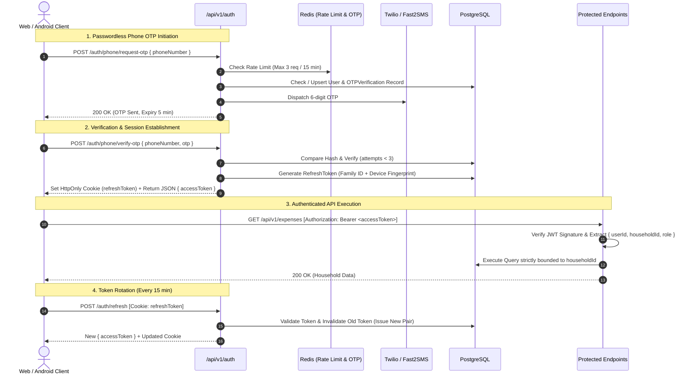

# HomeMind AI — Security & Authentication Architecture

**Document Version:** 2.0.0  
**Status:** Approved  
**Author:** HomeMind Security & Architecture Team  
**Last Updated:** October 2026  

---

## 1. Security Philosophy & Threat Model (STRIDE)

HomeMind AI handles sensitive financial records, real-time banking SMS alerts, family schedules, and home asset records. Security operates on a **Zero-Trust, Tenant-Isolated Defense-in-Depth** model.

### 1.1. STRIDE Threat Assessment & Remediations

| Threat Category | Primary Risk in HomeMind | Engineered Countermeasure |
| :--- | :--- | :--- |
| **Spoofing Identity** | Attacker impersonates family member via stolen credentials or forged SMS payloads. | Dual-token rotation with device fingerprinting; cryptographic SMS sync verification; mandatory multi-factor OTP verification. |
| **Tampering with Data** | Attacker modifies ledger entries or alters `household_id` to tamper with another home's finances. | Tenant Context enforcement in middleware; client-provided tenant IDs are strictly discarded; SHA-256 idempotency integrity checks. |
| **Repudiation** | User denies performing a transaction or deleting a household record. | Immutable append-only audit trail logging for all financial write operations, including user ID, IP address, and timestamp. |
| **Information Disclosure** | Cross-tenant data leakage (BOLA / IDOR); interception of financial SMS in transit. | Row-level tenant isolation enforced via Prisma client extensions; TLS 1.3 in transit; AES-256-GCM encryption for stored PII. |
| **Denial of Service** | OTP SMS endpoint flooding; SMS sync endpoint exhaustion. | Tiered distributed rate limiting (Redis token bucket); per-IP and per-phone cooldown windows; CAPTCHA triggers on repeated failures. |
| **Elevation of Privilege** | A `MEMBER` or `GUEST` executes administrative actions (e.g. changing currency, deleting household). | Fine-grained Role-Based Access Control (RBAC) enforced via declarative route guards. |

---

## 2. Authentication Lifecycle & Token Architecture



---

## 3. Dual-Token Rotation & Replay Attack Defense

HomeMind uses a cryptographically secure **Refresh Token Rotation (RTR)** mechanism:

### 3.1. Token Specifications
- **Access Token:** Short-lived JWT (15-minute validity).
  - Claims: `sub` (User UUID), `householdId` (UUID), `role` (OWNER/ADMIN/MEMBER/GUEST), `iat`, `exp`.
  - Signature: HMAC-SHA256 (`HS256`) using rotated secret key.
- **Refresh Token:** Cryptographically random 64-byte opaque string (7-day validity).
  - Stored hashed via SHA-256 in the `RefreshToken` database table.
  - Delivered strictly through an `HttpOnly`, `Secure`, `SameSite=Strict` cookie to prevent Cross-Site Scripting (XSS) extraction.

### 3.2. Automatic Family Revocation (Replay Defense)
If an already-used or revoked refresh token is presented:
1. The backend detects an active replay attempt.
2. The entire **token family** associated with that user session is immediately purged from the database.
3. All active sessions on that device are terminated, forcing re-authentication and logging a high-severity security alert.

---

## 4. Multi-Tenancy & BOLA / IDOR Defense

**Broken Object Level Authorization (BOLA / IDOR)** is the #1 vulnerability in multi-tenant SaaS applications. HomeMind completely prevents BOLA by decoupling the client request from tenant resolution:

```typescript
// backend/src/middleware/auth.ts
export const attachHousehold = async (req: AuthenticatedRequest, res: Response, next: NextFunction) => {
  // CRITICAL: We NEVER read householdId from req.params, req.query, or req.body.
  // It is derived exclusively from the verified JWT payload.
  const householdId = req.user?.householdId;

  if (!householdId) {
    return res.status(403).json({
      success: false,
      error: { code: 'TENANT_CONTEXT_MISSING', message: 'No active household attached to token' },
    });
  }

  // Bind to request context
  req.householdId = householdId;
  next();
};
```

---

## 5. Role-Based Access Control (RBAC) Matrix

| Resource / Action | OWNER | CO-OWNER | ADMIN | MEMBER | GUEST |
| :--- | :---: | :---: | :---: | :---: | :---: |
| **View Dashboard & Ledgers** | ✅ | ✅ | ✅ | ✅ | ✅ (Limited) |
| **Log Expense / Income** | ✅ | ✅ | ✅ | ✅ | ❌ |
| **Sync Bank / UPI SMS** | ✅ | ✅ | ✅ | ✅ | ❌ |
| **Add / Edit Recurring Bills** | ✅ | ✅ | ✅ | ❌ | ❌ |
| **Manage Grocery Inventory** | ✅ | ✅ | ✅ | ✅ | ✅ (Read) |
| **Assign & Complete Tasks** | ✅ | ✅ | ✅ | ✅ | ✅ (Assigned) |
| **Invite / Remove Family Members** | ✅ | ✅ | ✅ | ❌ | ❌ |
| **Update Household Settings & Currency**| ✅ | ✅ | ✅ | ❌ | ❌ |
| **Delete Household Workspace** | ✅ | ❌ | ❌ | ❌ | ❌ |

---

## 6. Rate Limiting & Distributed Brute-Force Shields

Endpoints are protected by layered rate limiting powered by Redis:

| Route Path | Window | Max Requests | Action on Exceeded |
| :--- | :--- | :--- | :--- |
| `/api/v1/auth/phone/request-otp` | 15 minutes | 5 per phone / IP | HTTP 429 + Cooldown Timer |
| `/api/v1/auth/phone/verify-otp` | 15 minutes | 5 attempts | HTTP 429 + Invalidate OTP |
| `/api/v1/auth/google` | 15 minutes | 30 requests | HTTP 429 |
| `/api/v1/transactions/sync` | 1 minute | 60 sync batches | HTTP 429 + Backoff Request |
| `/api/v1/*` (General Authenticated) | 1 minute | 300 requests | HTTP 429 |
